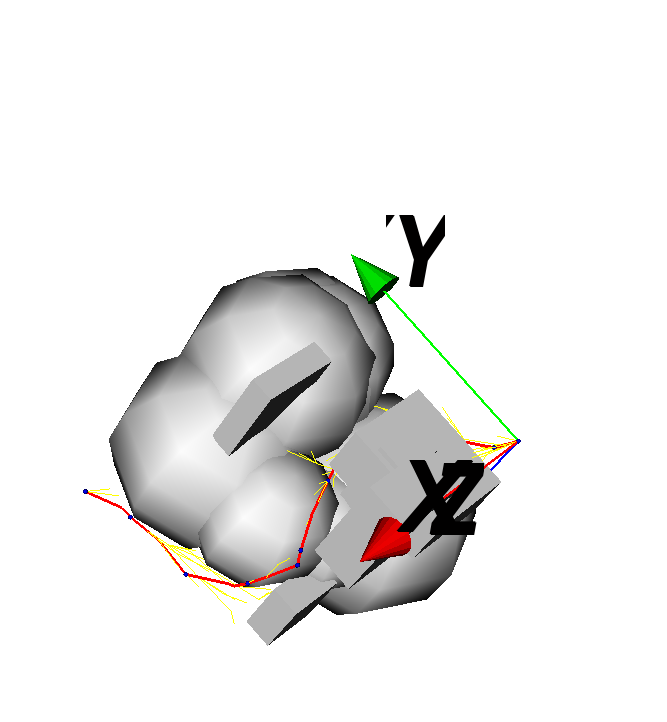

# RRT*-Connect_3D

## Coding for the path planning and Obstacle avoidance in 3D environment 
-The coding can be used for Industry Robot auto path planner together with Robot forward and inverse kinematic study.
-The coding is reference <b>RRT*-Connect</b> [here](https://github.com/Hritaban02/rrt_star_connect.git) and update it to 3D enviorment.
-The coding is random generate sphere and cube obstractle in VTK window, and show the final path in VTK with 3D environment.

### OUTPUT : VTK View 3D environment for obstractles generated randomly and final path from start to end with red color line.

